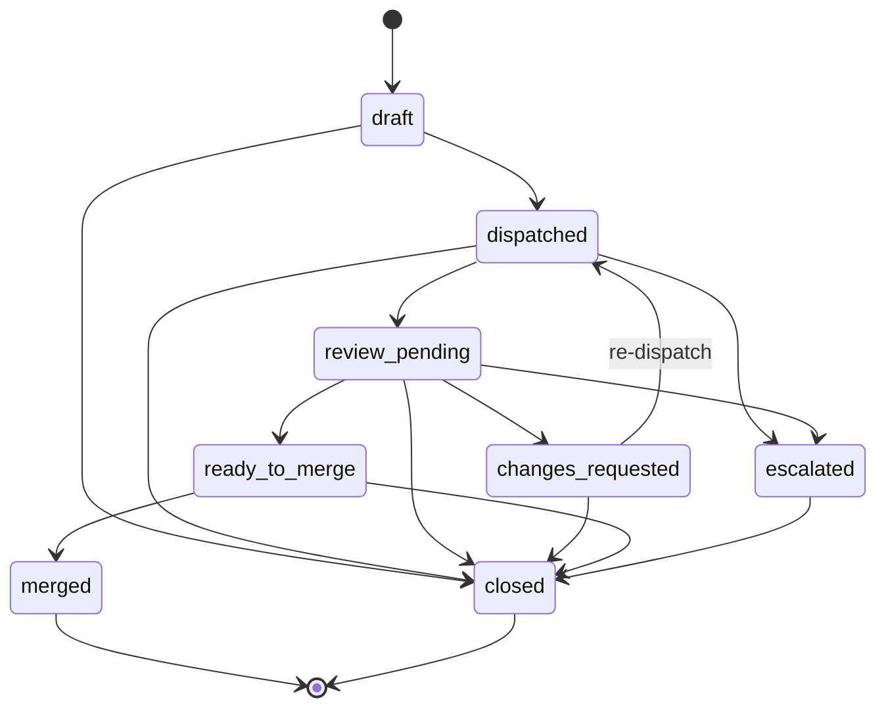

# dev-relay

[](LICENSE)
[](https://nodejs.org/)

**Delegate implementation to AI agents. Keep planning and review in your hands.**

## The Problem

You paste a task into an AI coding agent. It writes the code. You review the PR... but you wrote the prompt, so you're checking your own assumptions.

dev-relay runs the review in a **forked context**. The reviewer has no memory of the plan. It scores the diff against acceptance criteria, not the prompt. If the code doesn't pass the rubric, it gets sent back. Same issue three rounds in a row, the run escalates.

## Who Is This For

Built for **solo developers using AI agents** who need a second pair of eyes that isn't themselves. That's where it's battle-tested today.

The design should also fit team leads delegating work to AI agents (audit trail per merge) and open-source maintainers evaluating AI-generated PRs (rubric-based scoring instead of vibes). Those are plausible next steps, not proven yet.

## How It Flows

```
Orchestrator             Executor                    GitHub
 |                        |                            |
 +-- plan + rubric ------>[Codex | Claude]             |
 |                        +-- implement ------------->[ PR ]
 |                        |                            |
 +-- review (fresh ctx) <-+   [Codex | Claude]         |
 |   +- contract checks   |                            |
 |   +- rubric scoring    |                            |
 |   +- scope drift check |                            |
 |   +- quality sweep     |                            |
 |   +- issues found? --->+-- re-dispatch ----------->[ PR updated ]
 |                        |                            |
 +-- LGTM ------------------------------------------>[ ready_to_merge ]
 +-- explicit merge ----------------------------------[ merged ]
 +-- cleanup + sprint update                           |
```

Roles are bound at manifest creation time and remain the run's assigned role bindings. Any supported agent can plan, execute, or review. Standard Codex operation is `RELAY_ORCHESTRATOR=codex` plus `review-runner --reviewer codex`. If review-time overrides are used, the acting reviewer is recorded under `review.last_reviewer` and in the `review_apply` event payload instead of mutating `roles.reviewer`.

## Install

```bash
npx skills add sungjunlee/dev-relay
```

Installs all 6 skills as [Claude Code custom slash commands](https://docs.anthropic.com/en/docs/claude-code/skills). Add `-g -y` for global install without prompts:

```bash
npx skills add sungjunlee/dev-relay -g -y
```

<details>
<summary>Install from a local clone</summary>

```bash
git clone https://github.com/sungjunlee/dev-relay.git
cd dev-relay
npx skills add . -g -y
```
</details>

Working from a repo checkout without installing skills? See [docs/direct-read-relay-operator-note.md](docs/direct-read-relay-operator-note.md).

### Prerequisites

- [Claude Code](https://claude.ai/code) or [Codex](https://chatgpt.com/codex)
- [`gh` CLI](https://cli.github.com/) ... authenticated (`gh auth login`)
- Git 2.20+
- Node.js 18+

## Quick Start

### One command, full cycle

```
/relay 42
```

Reads issue #42, builds a scoring rubric if the task is complex, dispatches to the executor in a worktree, reviews the resulting PR, and stops at `ready_to_merge`. It runs all four phases (plan, dispatch, review, gate check) but does not auto-merge. Use `/relay-merge` to land it explicitly.

For raw or ambiguous requests, `/relay` now routes through `/relay-intake` first, persists a request artifact under `~/.relay/requests/<repo-slug>/`, freezes Done Criteria for review, then resumes the normal `relay-plan -> relay-dispatch -> relay-review` chain.

### Step by step

Use individual skills when you want control over each phase:

```bash
/relay-intake "fix the auth redirect mess"   # Shape a raw request into one relay-ready leaf + frozen Done Criteria
/relay-plan 42          # Convert issue AC into a scoring rubric
/relay-dispatch         # Dispatch to executor (worktree -> implement -> PR)
/relay-review fix/42    # Review PR in a fresh context
/relay-merge 123        # Gate-check -> explicit merge -> cleanup
```

## What Changes

| | Without relay | With relay |
|---|---|---|
| **Review independence** | Same context as the prompt | Reviewer has no memory of the plan |
| **Audit trail** | Chat history, maybe | Every round in manifest + PR comments |
| **Scope drift** | Not tracked | Detected per-round, flagged in verdict |
| **Convergence** | Manual back-and-forth | Loop until rubric passes or escalate |
| **Worktree isolation** | AI edits your working directory | Isolated worktree, your files untouched |
| **Re-dispatch context** | Start over or copy-paste feedback | Prior scores + feedback auto-prepended |
| **Merge safety** | Trust and merge | Gate check: stale review blocks merge |
| **Cleanup** | Manual | Worktree + branch + metadata cleaned automatically |

## How It Works

### Plan ... `/relay-plan`

Converts acceptance criteria into a **scoring rubric** that guides both the executor and the reviewer. If `/relay-intake` already produced `relay-ready/<leaf-id>.md`, that handoff brief becomes the planning source of truth:

| Rubric element | Example |
|---------------|---------|
| **Automated checks** | `npm test` exits 0, `tsc --noEmit` passes |
| **Evaluated factors** | Code quality 8+, naming consistency 7+, edge cases covered |
| **3-anchor scoring** | Each factor defines low/mid/high anchors for consistent grading |
| **Weights** | Required (must pass) vs best-effort (nice to have) |

The rubric travels with the task. The executor uses it to self-evaluate, and the reviewer re-scores independently.

Before building the rubric, `probe-executor-env.js` scans the project for available tools (npm scripts, Makefiles, pytest, etc.) so automated checks target real capabilities, not assumptions.

For L/XL tasks (5+ acceptance criteria), an optional stress-test catches gaming vectors and coverage gaps before dispatch.

> **When to skip rubrics:** Typos, one-liner fixes, simple bugs. Use rubrics for 3+ acceptance criteria or quality-sensitive work.

### Dispatch ... `/relay-dispatch`

Creates an isolated git worktree, merges the base branch for freshness, writes a relay run manifest, runs the executor with the task prompt, and collects results. Intake-produced runs can also carry `source.request_id`, `source.leaf_id`, and `anchor.done_criteria_path` so review stays anchored to the frozen snapshot instead of drifting to PR prose.

```bash
# Minimal
/relay-dispatch --branch fix/login-bug --prompt "Fix the null check in auth.ts"

# With rubric and extended timeout
/relay-dispatch --branch feat/search --prompt-file rubric.md --timeout 3600

# Intake-linked dispatch after relay-plan produced the executor prompt
/relay-dispatch --branch fix/login-loop --prompt-file /tmp/dispatch-login-loop.md --request-id <request-id> --leaf-id leaf-01 --done-criteria-file ~/.relay/requests/<slug>/<request-id>/done-criteria/leaf-01.md

# Resume after review requested changes (reuses retained worktree)
/relay-dispatch --run-id issue-42-20260403120000000 --prompt-file review-round-2-redispatch.md

# Dry run
/relay-dispatch --branch feat/search --prompt "Add search" --dry-run
```

On re-dispatch, iteration history (prior scores + reviewer feedback) is automatically prepended to the executor prompt so it has full context on what to fix.

<details>
<summary>All dispatch options</summary>

| Flag | Description | Default |
|------|-------------|---------|
| `--branch, -b` | Branch name | *required* |
| `--run-id` | Resume an existing retained relay run | ... |
| `--manifest` | Resume an existing retained relay run by manifest path | ... |
| `--prompt, -p` | Task prompt | *required (or --prompt-file)* |
| `--prompt-file` | Read prompt from file | ... |
| `--executor, -e` | Executor type (`codex` or `claude`) | `codex` |
| `--model, -m` | Model override | ... |
| `--sandbox` | `workspace-write` or `read-only` | `workspace-write` |
| `--copy` | Additional files to copy (comma-separated) | ... |
| `--timeout` | Timeout in seconds | `1800` |
| `--register` | Additionally register in executor app (worktrees are retained by default) | `false` |
| `--dry-run` | Print plan, don't execute | `false` |
| `--json` | Structured JSON output | `false` |

**Timeout guidance:** 1800s for simple tasks, 3600s with self-review, 5400s for complex multi-file work.

Manifests are stored at `~/.relay/runs/<repo-slug>/<run-id>.md` with an append-only event journal at `~/.relay/runs/<repo-slug>/<run-id>/events.jsonl`.

Successful dispatches retain their worktree by default so review, follow-up fixes, and manual inspection can continue in the same run context.
</details>

### Review ... `/relay-review`

Runs in a **forked context**. The reviewer has no memory of the planning phase, ensuring unbiased evaluation.

The review loops until convergence (most PRs: 1-3 rounds, configurable cap, default 20):

1. **Contract checks** ... Is the implementation faithful to the AC? Any stubs or placeholders?
2. **Rubric verification** ... Re-run automated checks, re-score evaluated factors independently
3. **Scope drift detection** ... Flag out-of-scope changes (creep) and incomplete acceptance criteria (missing)
4. **Quality sweep** ... Structural review, code simplification, churn metric tracking across rounds
5. **Structured verdict** ... JSON verdict with per-issue `file:line`, category, severity

The verdict is posted as a PR comment with a machine-readable marker:

```
Verdict: LGTM           # or
Verdict: ESCALATED      # with specific issues and file:line references
```

If changes are requested, the runner writes a targeted `review-round-N-redispatch.md` for the next executor pass. Repeated issues are fingerprinted across rounds. The same issue recurring 3 consecutive rounds triggers escalation.

### Merge ... `/relay-merge`

Before merging, a **gate check** verifies:
- The relay-review audit trail exists on the PR
- `review.last_reviewed_sha` matches the current PR head (stale review = merge blocked)
- CI checks pass and merge queue is clear

After gate check passes:
1. Merge the PR and mark the manifest `merged`
2. Best-effort close the linked GitHub issue
3. Remove the retained worktree, delete the merged local branch, prune git metadata
4. Record `cleanup.status` in the manifest (failures become explicit follow-up)
5. Update sprint state and create follow-up issues if needed

For hotfixes, `finalize-run.js --skip-review "reason"` bypasses the review gate while recording the skip reason in both the manifest and the PR. There's always a paper trail.

## Skills

| Command | Phase | Description |
|---------|-------|-------------|
| `/relay [issue]` | All | Full cycle through `ready_to_merge` |
| `/relay-intake [request]` | Intake | Shape a raw request into a single relay-ready handoff + frozen Done Criteria |
| `/relay-plan [issue]` | Plan | Build scoring rubric from acceptance criteria |
| `/relay-dispatch` | Execute | Dispatch to executor via git worktree isolation |
| `/relay-review [branch]` | Review | Independent PR review with convergence loop |
| `/relay-merge [PR]` | Ship | Explicit merge after LGTM, cleanup worktree, update sprint |

## Real-World Scenarios

### Hotfix: production is down

```bash
/relay-dispatch -b hotfix/null-check -p "Fix NPE in auth.ts:47, null session token" --timeout 600
# Review comes back clean in 1 round
/relay-merge 128   # finalize-run.js --skip-review "hotfix: production 500s"
```

Skip review is recorded in the audit trail. You'll see it later.

### Complex feature: 6 acceptance criteria

```bash
/relay-plan 42                    # Builds rubric with 3-anchor scoring, stress-tests for gaps
/relay-dispatch -b feat/search    # Executor self-evaluates against rubric
/relay-review feat/search         # Reviewer re-scores independently, scope drift check
# Round 1: changes_requested (missing edge case)
/relay-dispatch --run-id ...      # Iteration history auto-prepended
/relay-review feat/search         # Round 2: LGTM
/relay-merge 130
```

### Batch dispatch: 3 independent tasks

```bash
# Dispatch all three in parallel
/relay-dispatch -b fix/typo-1 -p "Fix typo in header"
/relay-dispatch -b fix/typo-2 -p "Fix typo in footer"  
/relay-dispatch -b feat/badge -p "Add status badge to README"

# Review and merge as they complete
/relay-review fix/typo-1 && /relay-merge 131
/relay-review fix/typo-2 && /relay-merge 132
/relay-review feat/badge && /relay-merge 133
```

Worktree isolation makes parallel dispatch safe. Each executor works in its own directory.

## Design Philosophy

**Context isolation.** The reviewer runs in a forked context with no access to the planning prompt. It sees the diff and the acceptance criteria. This is the core design choice. Everything else follows from it.

**Rubric-based scoring.** A rubric defines what "good" means before the code is written. The executor self-evaluates during implementation. The reviewer re-scores independently. Three-anchor scoring (low/mid/high examples per factor) keeps grading consistent across rounds.

**Manifests over prompts.** Every run produces a manifest at `~/.relay/runs/<repo-slug>/<run-id>.md`. It records who planned, who executed, who reviewed, what the policy was, and what happened. No database, no daemon. Markdown files with YAML frontmatter and an append-only event journal.

**State machine.** Eight states with enforced transitions. You can't merge without a review. You can't re-dispatch without a changes_requested verdict. Direct state assignment is a bug.

## State Machine

Each relay run follows a manifest-backed state machine stored at `~/.relay/runs/<repo-slug>/<run-id>.md`:



<details>
<summary>ASCII fallback (for non-GitHub viewers)</summary>

```
  +----------+
  |  draft   |-----------------------------------------+
  +----+-----+                                         |
       v                                               v
  +-----------+                                  +---------+
  | dispatched|------------------------+         | closed  |
  +-----+-----+                        |         +---------+
        v                              v              ^
  +-----------------+            +-----------+        |
  | review_pending  |----------->| escalated |--------+
  +--+-----------+--+            +-----------+
     |           |
     v           v
+-------------------+     +----------------+
| changes_requested |     | ready_to_merge |
+---------+---------+     +-------+--------+
          |                       |
          v (re-dispatch)         v
     dispatched              +--------+
                             | merged |
                             +--------+
```
</details>

Terminal states: `merged`, `closed`. Transitions are enforced in code. Direct state assignment is a bug. An append-only event journal at `~/.relay/runs/<repo-slug>/<run-id>/events.jsonl` records every transition.

## Extending

dev-relay is designed to support new agents. No framework changes needed.

### Adding a new executor

1. Add an entry to `EXECUTOR_CLI` in `skills/relay-dispatch/scripts/dispatch.js`:
   ```js
   const EXECUTOR_CLI = { codex: "codex", claude: "claude", yourAgent: "your-agent-cli" };
   ```

2. Add an execution branch in the same file to wire up CLI arguments for the new executor

3. Optional: app registration uses `create-worktree.js --register` (currently Codex-only, [#87](https://github.com/sungjunlee/dev-relay/issues/87) tracks broader support)

### Adding a new reviewer

1. Create `skills/relay-review/scripts/invoke-reviewer-<name>.js`
2. The script receives: `--repo <path> --prompt-file <path> [--model <name>] [--json]`
3. It must write a JSON verdict to stdout matching the schema in `review-schema.js`
4. `review-runner.js` resolves adapters by constructing `invoke-reviewer-<name>.js` from the `--reviewer` flag or manifest role binding

### Role binding

Roles are set at manifest creation time as the run's assigned bindings:

```yaml
roles:
  orchestrator: codex     # who drives the lifecycle
  executor: codex         # who implements
  reviewer: claude        # who reviews (isolated context)
```

Override the reviewer at review time with `--reviewer` or the `RELAY_REVIEWER` environment variable. That changes the acting reviewer for that round, which is recorded in `review.last_reviewer` and the `review_apply` event payload.

## `.worktreeinclude`

Git worktrees don't include gitignored files (`.env`, config, keys). Add a `.worktreeinclude` file to your project root to auto-copy them into worktrees:

```
# .worktreeinclude
.env
.env.local
config/*.key
```

**Safety:** Only files matching BOTH `.worktreeinclude` AND `.gitignore` are copied. This prevents accidentally including tracked files. Glob patterns are supported. Missing files are silently skipped.

The `--copy` dispatch flag works as an explicit override for one-off cases. To copy `.env` files, add them to `.worktreeinclude` instead — this ensures the gitignore safety check applies.

## Reliability and Cleanup

### Stale cleanup

Merged and explicitly closed runs are cleaned by `/relay-merge`. For safety, a repo-local janitor is also available:

```bash
node skills/relay-dispatch/scripts/cleanup-worktrees.js --repo . --dry-run
node skills/relay-dispatch/scripts/cleanup-worktrees.js --repo . --older-than 72 --json
```

Close stale non-terminal runs explicitly:

```bash
node skills/relay-dispatch/scripts/close-run.js --repo . --run-id <run-id> --reason "stale"
```

### Reliability scorecard

Aggregate metrics from run history:

```bash
node skills/relay-dispatch/scripts/reliability-report.js --repo .
node skills/relay-dispatch/scripts/reliability-report.js --repo . --json
```

Tracks: resume success rate, median review rounds, stale run count, terminal state distribution.

## Works With dev-backlog

dev-relay works standalone. It reads acceptance criteria from GitHub issues or direct input.

For sprint-level orchestration, pair it with [dev-backlog](https://github.com/sungjunlee/dev-backlog):

- **GitHub Issues** define the work (AC, labels, milestones)
- **Sprint files** organize execution (batching, ordering, context, progress)
- **relay** reads from both, updates sprint files at each phase

## Known Limitations

- **Nested Codex GitHub API calls**: When Codex runs as executor inside a nested session, `gh pr create` and some `gh` API calls can fail with `error connecting to api.github.com`, even when `git push` succeeds. Workaround: create the PR manually against the already-pushed branch, or rerun the orchestrator without sandboxing.
- **Sandbox sensitivity**: `codex exec --full-auto` and stricter sandbox modes behave differently for GitHub reachability. If the executor can push but can't create a PR, try a less restrictive sandbox setting.
- **Sprint-file automation is partial**: The relay loop works end-to-end, but plan status transitions (`[ ] -> [~] -> [x]`) and merge-time Running Context updates in sprint files still require manual intervention.

See [docs/codex-orchestrator-e2e-validation-2026-04-03.md](docs/codex-orchestrator-e2e-validation-2026-04-03.md) for the full validation report.

## FAQ

**Does this replace human code review?**
No. It adds an independent AI review layer. The reviewer catches rubric failures, scope drift, and structural issues. Human review still makes sense for product decisions, UX judgment, and domain-specific concerns.

**Can I use Claude Code without Codex, or vice versa?**
Yes. Either works as both executor and reviewer. Set the executor with `--executor codex` or `--executor claude`. Set the reviewer with `--reviewer codex` or `--reviewer claude`. Mix and match.

**What if the AI hallucinates or writes broken code?**
The rubric scoring and convergence loop catch it. Automated checks (tests, type checks) must pass. Evaluated factors are scored against defined anchors. If the code doesn't converge after the configured maximum rounds (default 20), the run escalates instead of merging broken code.

**Does this work with other LLMs beyond Claude and Codex?**
The executor and reviewer are adapters. Adding a new one means creating one file (`invoke-reviewer-<name>.js` or a dispatch branch) that wires up the CLI. See [Extending](#extending).

**Do I need GitHub?**
Yes. GitHub PRs are the handoff boundary between executor and reviewer. The gate check, audit trail, and merge flow all use GitHub's API. GitLab and other forges are not currently supported.

## Contributing

Issues and PRs welcome. Please open an issue first for non-trivial changes.

### Where to start

- **Good first issues**: Look for the [`good first issue`](https://github.com/sungjunlee/dev-relay/labels/good%20first%20issue) label
- **Add a new executor or reviewer**: See [Extending](#extending) for the adapter pattern
- **Architecture overview**: See [CLAUDE.md](CLAUDE.md) for the project structure and design decisions
- **Reference docs**: See [references/architecture.md](references/architecture.md) for the manifest schema, state transitions, and extension points

### Running tests

```bash
node --test skills/relay-intake/scripts/*.test.js
node --test skills/relay-plan/scripts/*.test.js
node --test skills/relay-dispatch/scripts/*.test.js
node --test skills/relay-review/scripts/*.test.js
node --test skills/relay-merge/scripts/*.test.js
```

## License

MIT
